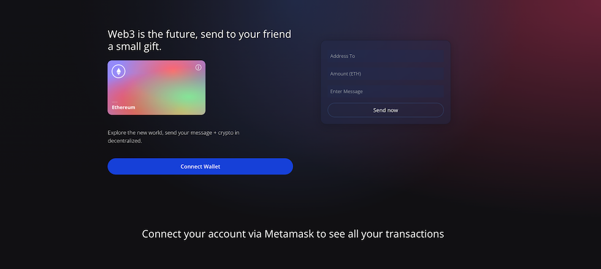

## Introduction

Web application for fun to send ETH and message friendly.

Please use Ropsten network if you want to try :)

Using SOLIDITY to write smart contract and <a href="https://www.alchemy.com/"><strong>Alchemy</strong></a> BLOCKCHAIN API.

React application with <a href="https://github.com/tailwindlabs/tailwindcss"><strong>Tailwindcss</strong></a>
## DEMO

## Environment

.env.example show you an example using your private key and your Alchemy URL.